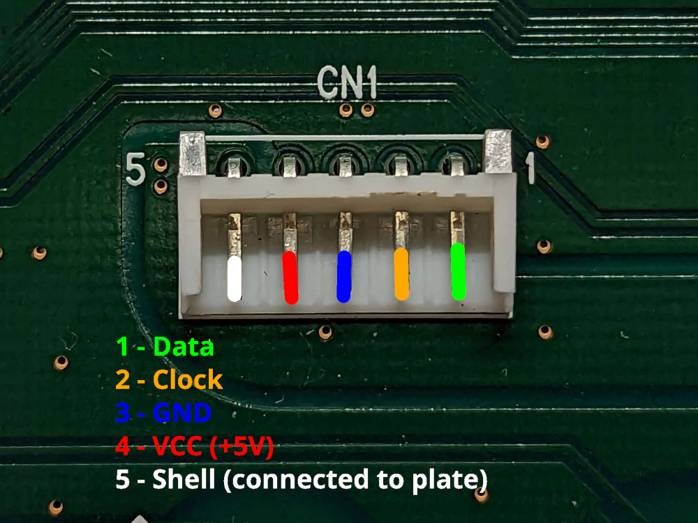

⚠️ WORK IN PROGRESS ⚠️

# USB converter for PS/2 RealForce R1 keyboards

This is a fork of converter/ibm_terminal.  
It's based on the PS/2 Scan Code Set 3 and runs on STM32s, tested on a
STM32F103C6T6 Bluepill with a RealForce 89.

# Warning
At the time of writing, you'd be unable to compile the code with upstream QMK
due to [this bug](https://github.com/qmk/qmk_firmware/issues/20054), either
follow the instructions on the issue or wait.  
Also, currently only alpha keys work properly, mod keys probably need different
scancodes as they are all over the place.

## Connection

The pins are defined in the `board` folder of the controller of your choice,
B12 for data and B13 for clock for the Bluepill Low-Density.
Also connect +5V VCC and GND, of course.  

The pinout of the JST connector on the back of the PCB is the following.  
The numbers are printed on the sides, 1 is rightmost and 5 is leftmost:

Pin | Function
:-- | :-------
1   | Data
2   | Clock
3   | GND
4   | VCC (+5V)
5   | Shell (connected to plate)

For reference, my PCB has the code 39-ND-0101. An easy way to recognize a PS2
board, should you not get a cable or get the wrong one, is to check the DIP
switches: according to the Deskthority wiki, none of the PS/2 models have one;
with that said, some USB models also don't have one.

# Building info
Copy the repo inside keyboards/exentio in the QMK repo, then build with the following command:  
`qmk compile -kb exentio/ps2usb_realforce/boards/bluepill_ld -km default`  
The default layout is the normal RealForce 91, change to `-km 89` for the RealForce 89.  
~~Truth is, they're basically the same, the 91 works on both.~~

## References
The code I based this one on: https://github.com/qmk/qmk_firmware/tree/master/keyboards/converter/ibm_terminal  
Where I got most codes: https://github.com/nsd20463/ps2_kbd_to_usb_adapter/blob/master/keycodes.c  
More info for JIS layouts: http://www.quadibloc.com/comp/scan.htm  
Special thanks to sigproof from the official QMK Discord for helping me squash some bugs!